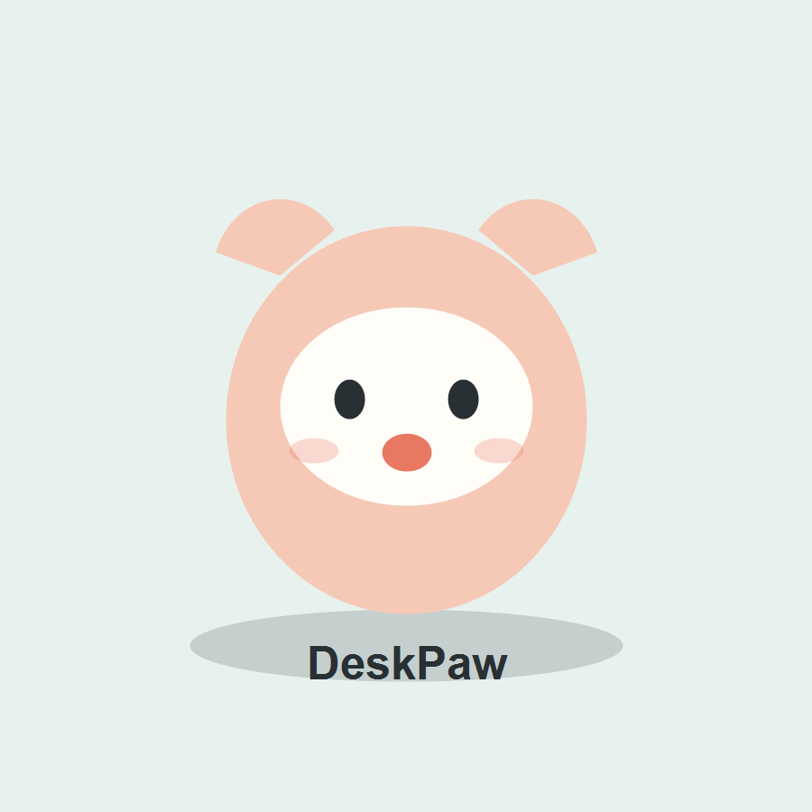

# DeskPaw 桌面爪爪

把宠物照片生成一个可安装到手机桌面的陪伴小宠。  
Turn a pet photo into a warm, installable mobile companion.

[在线体验 / Live App](https://estherliu-lab.github.io/deskpaw/) ·
[中英介绍页 / Bilingual Showcase](https://estherliu-lab.github.io/deskpaw/showcase/) ·
[GitHub Repo](https://github.com/estherliu-lab/deskpaw)

<p align="center">
  <a href="https://estherliu-lab.github.io/deskpaw/">
    
  </a>
</p>

## 手机扫码 / Scan on Mobile

<p align="center">
  
</p>

用手机扫码打开后，在 Safari 或 Chrome 中选择“添加到主屏幕”，就可以像 App 一样打开 DeskPaw。

Open it on your phone, then use Safari or Chrome to add DeskPaw to your home screen.

## 功能 / Features

- 上传宠物照片，生成本地 DeskPaw 档案。
- 支持 17 种视觉风格和 15 种动作状态。
- 中英双语界面，可一键切换。
- 宠物小屋包含专注计时、喝水提醒、鼓励语和互动记录。
- Canvas 生成并下载分享卡片。
- PWA 支持：manifest、图标、service worker、离线页。
- 预留 `generatePetCharacter` 接口，后续可接入 AI 图像生成或背景移除。

## Showcase Page

仓库附带一个更适合宣传的中英介绍页：

`https://estherliu-lab.github.io/deskpaw/showcase/`

这个页面包含：

- 中文 / English 点击切换
- 手机 App 预览
- 功能示例卡片
- 美观扫码安装区

## Local Development

```bash
npm install
npm run dev
npm run build
npm run preview
```

The development server defaults to:

`http://127.0.0.1:5173/deskpaw/`

## Privacy

DeskPaw V1 默认在浏览器本地处理和保存上传的宠物照片，不会自动上传到服务器。  
DeskPaw V1 processes uploaded pet photos locally by default and does not automatically upload them to a server.

## Roadmap

- AI 宠物形象生成与背景移除
- 更多分享卡片模板
- IndexedDB 本地图片库
- 真正透明、可拖拽、可置顶的桌面宠物版本
- 托盘菜单、专注计时、喝水提醒
- 可选云同步，且明确提示用户授权

## License

MIT
